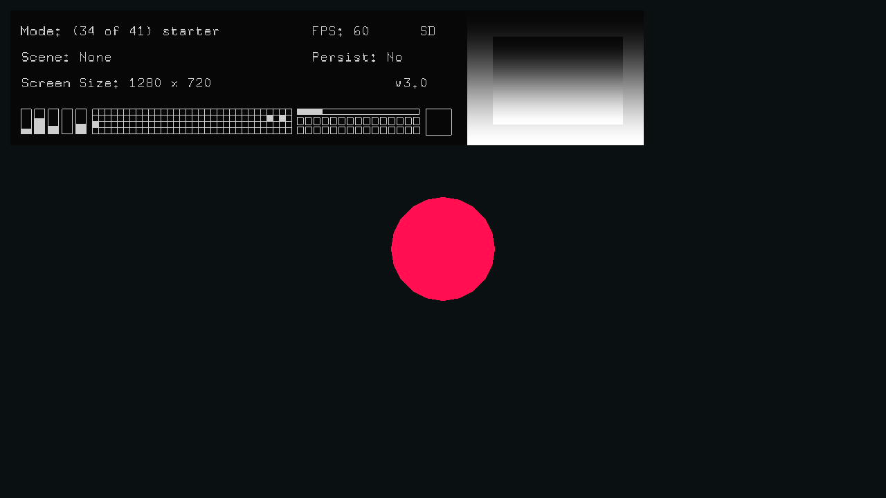

# EYESY Platform

A GPU-accelerated engine for the [Critter & Guitari EYESY](https://www.critterandguitari.com/eyesy)
video synthesizer. You write modes in Lua, and the EYESY's own GPU renders them
with OpenGL ES 2 at up to 60 fps, with full stereo audio analysis, shaders and
video feedback. The knobs, buttons, scenes, knob sequencer and on-screen display
work the same way they do on the stock OS.

> [!NOTE]
> **This is an unofficial project.** It is not affiliated with or endorsed by
> Critter & Guitari. It installs alongside the stock EYESY OS, and one command
> switches the instrument back to stock. Read [Status](#status) before you
> install it on your instrument.

## Why a new engine?

Critter & Guitari have shipped two kinds of EYESY engine. **EYESY OS v3**, which
ships today, is written in Python. It draws every frame with pygame on the CPU
and caps output at 30 fps, so the Raspberry Pi's GPU does no rendering at all.
The first-generation **EYESY_OF** ran Lua modes on openFrameworks with OpenGL.
However, it was built against Broadcom GL libraries that current KMS-based
images no longer ship, it depends on an `eyesy.lua` library that was never
published, and it has not been updated since 2022.

This platform keeps the instrument and replaces the engine underneath it.

| | Stock EYESY OS v3 | EYESY_OF (first generation) | **This platform** |
| --- | --- | --- | --- |
| Rendering | pygame, on the CPU | OpenGL ES 2 via the legacy Broadcom libraries | **OpenGL ES 2 on the VC4 GPU (Mesa), scanned out directly with KMS** |
| Frame rate | Capped at 30 fps | No 30 fps cap | **Up to 60 fps**: simple modes hold 60, and heavy shader scenes run at about 25–50 |
| Mode language | Python | Lua with raw openFrameworks bindings | **Lua (LuaJIT) with a versioned, documented API** |
| Shaders and feedback | None | Possible through raw openFrameworks | **Fragment shaders with hot reload, 8 render targets for feedback, reusable meshes, 3D camera and depth** |
| Audio given to modes | 100 averaged samples per channel | 256 samples at 11 kHz, left channel only | **1,024 samples per channel at 48 kHz, a 513-bin FFT per channel, 3 bands, RMS/peak, and a waveform texture for shaders** |
| MIDI given to modes | Note states | Last note and velocity | **Notes, all 128 CCs, clock, transport and timestamped events** |
| Mode isolation | Every mode loads into one Python process at boot, and module state survives mode switches | Not documented | **A fresh Lua state for every load and reload** |
| Runs on the current EYESY image | Yes | Needs the legacy GL stack | **Yes, alongside stock** |
| Instrument controls | The reference | Basic: modes, OSD and trigger | **Stock-compatible: shift shortcuts, knob sequencer, HUD, 43 palettes, config menu, LED and trigger tone** |

## What you get

### GPU graphics on the instrument

Every mode renders on the GPU. The engine draws finished frames straight to HDMI
through KMS, with no X server. Modes can use fragment shaders, ping-pong render
targets for feedback, meshes, images, and a perspective camera with depth
testing. This makes reaction–diffusion, fractal zooms and MilkDrop-style
feedback practical on a Compute Module 3+. Each mode is benchmarked on the
device itself, because desktop timings don't predict VC4 performance. Simple
modes run at 60 fps, and heavy shader scenes run at about 25 to 50 fps. See [the
tier table](docs/SCENE-LIBRARY.md).

### Detailed stereo audio

Stock OS v3 gives each mode 100 averaged samples per channel. Here, every frame
gets 1,024 samples per channel, a 513-bin FFT per channel, low/mid/high bands,
RMS and peak. The waveform is also a GPU texture that any shader can sample.
Audio capture runs on its own thread and writes to a non-blocking ring buffer,
so a slow frame never blocks audio. A 3-million-frame stress test passes under
ThreadSanitizer.

### It still works like an EYESY

The controls follow the EYESY OS v3 manual:

- Shift shortcuts and palette cycling
- Save a new scene, update a scene in place, or hold Save to delete it
- The knob sequencer, with its LED colours
- Shift + knob 1 to set input gain
- A test tone while the trigger button is held
- The 43 stock palettes, or your own set from `System/palettes.json`
- A configuration menu with a hardware test screen

A 13-step automated suite drives these controls on the device over OSC. It
checks the result at every step and captures the HDMI output.


<sub>The stock-layout HUD on the instrument, captured from its HDMI output: knob sliders, the MIDI note grid, VU meters and palette swatches, at 60 fps.</sub>

### A mode error won't stop the show

If a mode throws an error, the engine shows an error screen and the controls
stay live. You can switch modes, or fix the file and let it reload. If a shader
edit fails to compile, the last working program keeps running. The engine runs
under a systemd watchdog. If it cannot start, systemd hands the instrument back
to the stock OS, and this recovery path has been tested on hardware.

### Develop on your computer

The same engine runs on a Linux desktop:

- **Hot reload.** Edit a mode's Lua or shader file and it reloads. The keyboard
  stands in for the knobs and buttons.
- **Repeatable input.** Feed in a WAV file instead of live audio, and record and
  replay control input.
- **Headless runs.** Render without a window for automated checks.
- **Device runs without a screen.** Run a package on the EYESY's GPU and retrieve
  screenshots and timings with no display attached.
- **A scene verifier.** `tools/scene_verify.py` sweeps every knob and audio
  condition, and flags any control that doesn't change the picture.

### Safe to install and remove

Builds run in pinned containers against checksummed SDKs. Release archives are
byte-reproducible and record their provenance. Deployment works like this:

1. Check the target card's identity and the archive's contents.
2. Stage the new release next to the one that is running.
3. Switch to it with an atomic symlink.
4. Keep it only if frames advance on the GPU. Otherwise, restore the previous
   release, or the stock OS.

`eyesyctl rollback` returns to either one at any time. The stock EYESY software
stays installed, and only one of the two runs at a time.

### Backed by recorded runs

The claims above come from recorded runs on real hardware, which are kept in
[`evidence/`](evidence/):

- 60-minute soaks across 30 modes, with no crashes and a flat temperature
- A 216,000-frame run with 1,800 mode reloads, which grew memory by 80 KiB
- Sanitizer runs
- Rollback and recovery bench reports

## Status

This is a working development platform. It boots and runs on a CM3+ EYESY with
OS v3.0. Release manifests keep `hardware_validated: false` until the remaining
manual checks are done. Those checks cover knob and button feel, a known stereo
signal on the line input, and HDMI display latency. See the [implementation
status](docs/STATUS.md) and the [roadmap](ROADMAP.md).

Current limitations:

- **Hardware.** It has been tested only on a CM3+ EYESY running OS v3.0. CM4
  units are untested.
- **Output.** It renders at 1280×720 over HDMI. Composite video and native 1080p
  rendering are not supported.
- **Stock modes.** Python modes from the stock OS don't run as they are. They
  must be ported to Lua, and the [factory pack](#mode-packs) is doing that.
- **Setup and management.** There is no Wi-Fi setup or web editor. You install
  and manage the platform over SSH from a Linux workstation with `eyesyctl`.
  The stock web editor controls only the stock OS.
- **Menu.** The menu has no Wi-Fi, MIDI program-change, backup or log screens,
  and loading modes from a USB drive isn't ported.
- **Persist.** The Persist button affects only modes that read
  `ctx.auto_clear`. Most modes still clear the screen every frame.
- **Known issue.** After a long session in which MIDI devices connect and
  disconnect many times, MIDI input can stop responding until the engine
  restarts.

## Getting started

### Requirements

- An x86-64 Linux workstation with:
  - Python 3
  - Rootless Podman
  - CMake, Ninja and g++, for the native tests
  - Podman's ARM emulation (qemu-user-static), for ARM builds
- To install on the instrument: a CM3+ EYESY on OS v3.0, and a spare microSD
  card. Keep your original card untouched.

### Run it on your desktop

```sh
git clone https://github.com/BrettKinny/eyesy-platform.git
cd eyesy-platform
./eyesyctl bootstrap                               # build container + checksummed openFrameworks SDK
./eyesyctl build
./eyesyctl test
./eyesyctl preview starter --headless --frames 120 # software rendering, no GPU needed
./eyesyctl prepare-native
./eyesyctl preview starter --native                # a window on your GPU
```

Headless reports, screenshots and saved scenes go under `local/`. Headless
previews use software rendering, so they check correctness but don't measure
performance.

In the desktop preview, these keys stand in for the hardware controls:

| Key | Action |
| --- | --- |
| 1–5 | Select a knob |
| Up / Down | Adjust the selected knob |
| Left / Right | Switch modes |
| R | Reload |
| Space | Trigger |
| N | Simulate a MIDI note |
| O | Toggle the OSD |
| C | Toggle clearing |
| S | Save a scene |
| [ / ] | Recall scenes |
| G | Save a screenshot |
| M | Open settings |

In settings, Up/Down selects a row, Left/Right changes its value, and Enter
saves.

### Mode packs

This repo contains the engine and one mode, `starter`. Other modes live in
**mode packs**: repos that each hold a flat set of mode folders, in the same
layout as the EYESY's `/sdcard/Modes`. `eyesyctl` finds any `eyesy-modes-*`
directory that sits next to this repo.

| Pack | Contents |
| --- | --- |
| [`eyesy-modes-factory`](https://github.com/BrettKinny/eyesy-modes-factory) | Lua ports of the stock Critter & Guitari OS v3 library (87 of 108 so far) |
| [`eyesy-modes-milkdrop`](https://github.com/BrettKinny/eyesy-modes-milkdrop) | A MilkDrop-style preset engine: one mode that plays a catalog of Lua-defined presets through warp and composite shader passes |

The author's collection of original scenes is kept private. Some docs in this
repo mention it (as `eyesy-modes-bespoke`) when they describe scene conventions
and performance.

```sh
cd ..
git clone https://github.com/BrettKinny/eyesy-modes-factory.git
git clone https://github.com/BrettKinny/eyesy-modes-milkdrop.git
cd eyesy-platform
./eyesyctl modes list
./eyesyctl preview milkdrop --native
```

`preview` and `test` find modes in the packs directly. Before you run
`package`, run `./eyesyctl modes sync` to copy the packs into `modes/`.

### Write a mode

A mode is a folder with a `main.lua` file, plus any shaders and images it uses.
This is the whole `starter` mode:

```lua
local e = eyesy
return {
  api_version = 1,
  setup = function(ctx)
    e.param("size", 0.5, 0.05, 1, 1)
    e.param("hue", 0.5, 0, 1, 4)
  end,
  draw = function(ctx)
    if ctx.auto_clear then
      e.clear(0.025, 0.035, 0.06)
    else
      -- Persist on: decay the previous frame instead of wiping it.
      e.color(0.025, 0.035, 0.06, 0.08)
      e.rect(0, 0, ctx.width, ctx.height)
    end
    e.color(e.palette(ctx.params.hue))
    e.circle(ctx.width / 2, ctx.height / 2,
      30 + ctx.params.size * 180 + ctx.audio.rms_left * 80)
    e.color(1, 1, 1)
    e.text("Your next mode starts here", 32, 48)
  end
}
```

To start your own pack with a copy of `starter` and preview it:

```sh
mkdir ../eyesy-modes-mine
./eyesyctl new-mode my-scene --pack ../eyesy-modes-mine
./eyesyctl preview my-scene --native
```

The [mode API](docs/API.md) covers the full interface: audio, MIDI, parameters,
palettes, meshes, render targets and shaders. The [scene library
conventions](docs/SCENE-LIBRARY.md) cover the knob contract and the performance
budgets that shipped modes must meet.

### Install on the EYESY

Read [deployment](docs/DEPLOYMENT.md) in full before you start. In outline:

1. Clone your original SD card to a spare card, and verify the copy.
2. Run `tools/prepare_clone.py` on the spare card. It installs your SSH key and
   enables SSH.
3. Build a release with `./eyesyctl bootstrap --arm`, `build --arm`,
   `modes sync`, and `package --arm`. Don't run a desktop build at the same
   time, because both builds share the source tree.
4. Prepare the device with `./eyesyctl provision`, then install the release with
   `./eyesyctl deploy`.
5. Check the device with `./eyesyctl status` and `./eyesyctl logs`, and go back
   with `./eyesyctl rollback --target previous` or `--target stock`.

You don't need a screen to test a package on the device first; see
[headless development](docs/HEADLESS-DEVELOPMENT.md).

## How it works

The engine is a C++17 openFrameworks 0.12.1 application that embeds LuaJIT
directly, with its own small binding layer instead of raw openFrameworks
bindings. On the EYESY, it takes over the display from KMS, and picks an HDMI
mode from the display's EDID. It gets the knobs and buttons from the stock
`eyesyhw` daemon over OSC on port 4000, and sends LED colours back on port 4001.
Audio comes from the EYESY's codec through ALSA, and MIDI comes through ALSA
sequencer ports.

| Path | What it holds |
| --- | --- |
| `engine/src/` | The engine: main loop, Lua runtime and API, audio capture and FFT, KMS/GBM display, HUD, menu, knob sequencer, palettes |
| `eyesyctl` | The CLI for bootstrap, build, test, preview, package, provision, deploy, status and rollback |
| `deploy/` | systemd units for the platform and its fallback to stock |
| `tools/` | Release, provisioning, benchmarking, scene-verification and hardware probe tools |
| `tests/` | Native C++ tests (CTest) and Python tests: unit tests, graphics integration and device suites |
| `evidence/` | Records of device runs that back the claims in the docs |
| `docs/` | API, workflow and hardware documentation; see the list below |

The switch to direct KMS came out of a hardware bug. On this board, any Xorg
session left the HDMI transmitter sending sync with blank pixels until the next
power cycle. [HDMI display issue](docs/HDMI-DISPLAY-ISSUE.md) documents the root
cause, down to the register bit.

## Documentation

- [Mode API](docs/API.md): the Lua interface modes are written against
- [Scene library conventions](docs/SCENE-LIBRARY.md): the knob contract, performance tiers and optimization notes
- [Creative runtime](docs/CREATIVE.md): palettes and the reference modes
- [Input workflow](docs/INPUT-WORKFLOW.md): WAV input and event record/replay
- [Headless development](docs/HEADLESS-DEVELOPMENT.md): testing on the device's GPU without a screen
- [Deployment](docs/DEPLOYMENT.md): preparing a card, provisioning, deploying and rolling back
- [EYESY OS v3 parity](docs/EYESY-OS-V3-PARITY-PLAN.md): how the stock instrument layer was ported and verified
- [Implementation status](docs/STATUS.md) and [roadmap](ROADMAP.md): what is done, what is open, and the dated history
- [Bench checklist](docs/BENCH-CHECKLIST.md): the remaining hardware acceptance checks
- Background research, written before the engine existed:
  - [the stock OS architecture](docs/background/stock-os-architecture.md)
  - [the earlier EYESY_OF engine](docs/background/eyesy-of-engine.md)
  - [the original ideas list](docs/background/ideas.md)

## Upstream sources

- [critterandguitari/EYESY_OS](https://github.com/critterandguitari/EYESY_OS): the stock OS (Python engine, web editor, CM3/CM4 platform layer)
- [critterandguitari/EYESY_Modes_OSv3](https://github.com/critterandguitari/EYESY_Modes_OSv3): the stock mode library
- [critterandguitari/EYESY_OF](https://github.com/critterandguitari/EYESY_OF): the earlier openFrameworks + Lua engine
- [critterandguitari/EYESY_oFLua_Examples](https://github.com/critterandguitari/EYESY_oFLua_Examples): example modes for EYESY_OF

## License

This project is released under the BSD 3-Clause License; see [LICENSE](LICENSE).
Parts of it are ported from Critter & Guitari's EYESY OS, which is also under
BSD 3-Clause. [THIRD_PARTY_NOTICES.md](THIRD_PARTY_NOTICES.md) lists those parts
and the other components.

EYESY is a trademark of Critter & Guitari, Inc. It is used here only to name the
hardware this software runs on.
